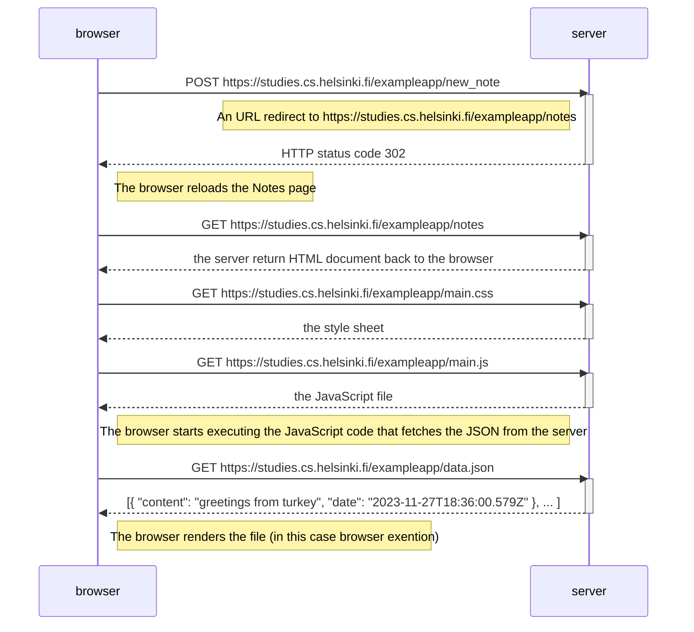

```mermaid
sequenceDiagram
    participant browser
    participant server

    browser->>server: POST https://studies.cs.helsinki.fi/exampleapp/new_note
    activate server
    Note left of server: An URL redirect to https://studies.cs.helsinki.fi/exampleapp/notes
    server-->>browser: HTTP status code 302
    deactivate server

    Note right of browser: The browser reloads the Notes page
    
    browser->>server: GET https://studies.cs.helsinki.fi/exampleapp/notes
    activate server
    server-->>browser: the server return HTML document back to the browser  
    deactivate server
    
    browser->>server: GET https://studies.cs.helsinki.fi/exampleapp/main.css
    activate server
    server-->>browser: the style sheet
    deactivate server
    
    browser->>server: GET https://studies.cs.helsinki.fi/exampleapp/main.js
    activate server
    server-->>browser: the JavaScript file
    deactivate server
    
    Note right of browser: The browser starts executing the JavaScript code that fetches the JSON from the server
    
    browser->>server: GET https://studies.cs.helsinki.fi/exampleapp/data.json
    activate server
    server-->>browser: [{ "content": "greetings from turkey", "date": "2023-11-27T18:36:00.579Z" }, ... ]
    deactivate server

    Note right of browser: The browser renders the file (in this case browser exention)

```
    